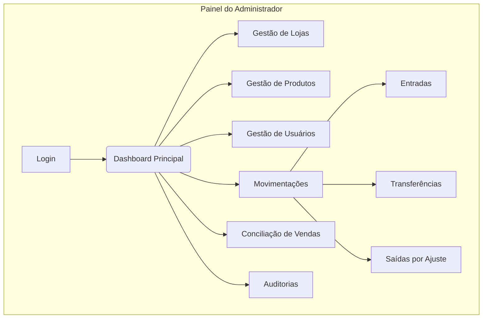
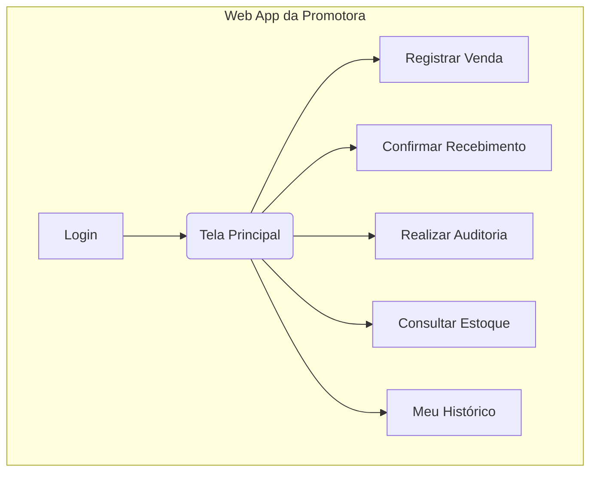

# 2. Arquitetura da Informação (IA)

## Mapa do Site / Inventário de Telas

### Painel do Administrador (Desktop):

### Web App da Promotora (Mobile):

## Estrutura de Navegação (Painel do Administrador)

- **Navegação Primária**: Barra lateral fixa (Dashboard, Vendas, Inventário, Auditorias).
- **Navegação Secundária**: Menu "Configurações" (Lojas, Produtos, Usuários).
- **Breadcrumbs**: Serão usados em todas as telas internas (ex: Painel > Lojas > Editar Loja XYZ).
