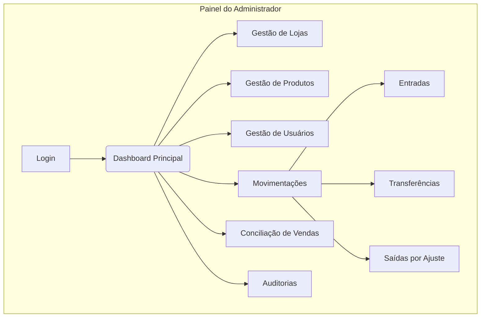
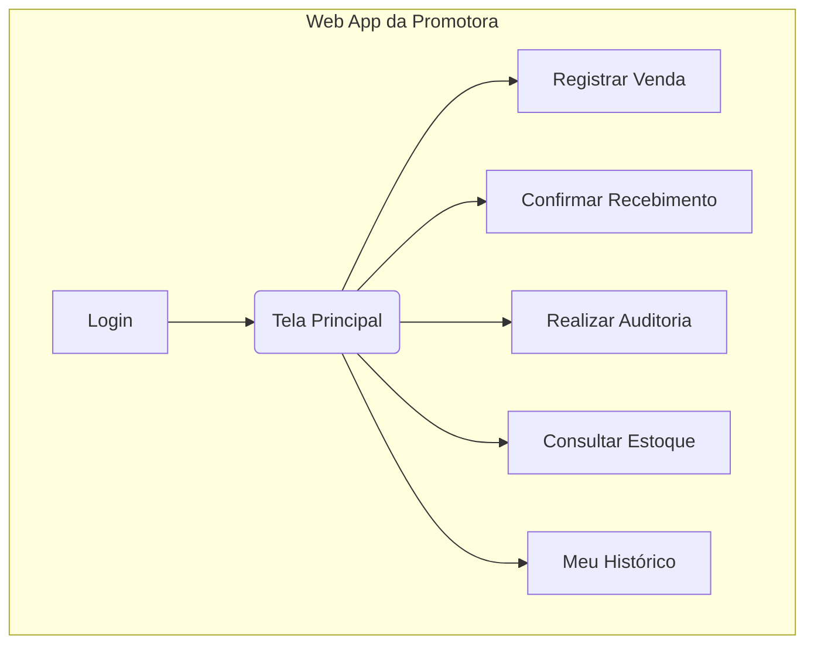

# UI/UX Specification: Controle de Inventário e Vendas - Falabella CO

## 1. Introdução e Princípios de UX

Este documento define os objetivos de experiência do usuário, a arquitetura da informação, os fluxos de usuário e as especificações de design visual para a interface do projeto de Controle de Inventário.

### Objetivos Gerais de UX e Princípios de Design

#### Personas de Usuário Alvo:
- **O Administrador (Alex)**: Um "Power User" que precisa de uma visão completa e controle total. A interface deve priorizar a densidade de informações e a eficiência.
- **A Promotora**: Uma "Usuária Focada em Tarefas" em um ambiente de loja que precisa de velocidade e clareza.

#### Metas de Usabilidade:
- **Velocidade para a Promotora**: Registrar uma venda em menos de 10 segundos.
- **Clareza para o Administrador**: Identificar uma divergência de estoque em menos de 30 segundos.
- **Facilidade de Aprendizagem**: Treinar uma nova promotora em menos de 5 minutos.

#### Princípios de Design:
- **Foco na Tarefa, Não na Ferramenta**: A tecnologia deve ser invisível.
- **Clareza Acima de Tudo**: Evitar ambiguidades. Cada elemento deve ter um propósito claro.
- **Mobile-First, Sempre**: A experiência da promotora será impecável no celular.
- **Feedback Imediato**: Cada ação deve ter uma resposta visual ou textual instantânea.
- **Dados Acionáveis, Não Apenas Visíveis**: Nenhuma lista de dados será "crua". Toda tela de consulta deve fornecer ferramentas eficientes de busca, filtro e ordenação.

## 2. Arquitetura da Informação (IA)

### Mapa do Site / Inventário de Telas

#### Painel do Administrador (Desktop):

#### Web App da Promotora (Mobile):

### Estrutura de Navegação (Painel do Administrador)

- **Navegação Primária**: Barra lateral fixa (Dashboard, Vendas, Inventário, Auditorias).
- **Navegação Secundária**: Menu "Configurações" (Lojas, Produtos, Usuários).
- **Breadcrumbs**: Serão usados em todas as telas internas (ex: Painel > Lojas > Editar Loja XYZ).

## 3. Fluxos de Usuário

### Fluxo 1: Registro de Venda (Promotora)
- **Diagrama**: Início -> Clicar 'Registrar Venda' -> Escanear/Digitar SKU -> Confirmar Produto e Quantidade -> Adicionar à cesta -> Finalizar Venda -> Sucesso.
- **Tratamento de Erros**: SKU não encontrado, estoque baixo (alerta, mas permite venda), falha de conexão (salvar localmente).

### Fluxo 2: Confirmação de Recebimento (Promotora) - Fluxo Híbrido
- **Descrição**: A interface principal exibe a lista de produtos a serem recebidos. A promotora pode confirmar manualmente ou usar um botão opcional de "Escanear" que age como um atalho para encontrar e destacar o item na lista.
- **Diagrama**: Início -> 'Confirmar Recebimento' -> Selecionar Ingresso -> Tela com lista de produtos -> Localizar na lista (manual) OU Escanear (opcional) -> Digitar quantidade recebida -> Repetir -> Finalizar e Confirmar -> Sucesso.
- **Tratamento de Erros**: Produto escaneado não pertence ao ingresso.

### Fluxo 3: Execução de Auditoria (Promotora)
- **Descrição**: Fluxo de contagem "cega". A promotora vê a lista de itens a contar, sem a quantidade teórica. Ela pode encontrar o item na lista (via busca) ou usar o scanner opcional para destacá-lo.
- **Diagrama**: Início -> 'Realizar Auditoria' -> Selecionar Auditoria -> Tela de Contagem (lista sem quantidades) -> Buscar/Escanear item -> Inserir quantidade contada -> Repetir -> Finalizar e Enviar -> Sucesso.
- **Tratamento de Erros**: Produto escaneado não pertence ao escopo da auditoria.

## 4. Wireframes e Mockups

### Abordagem
Descrição textual da estrutura das telas chave. O design visual detalhado será feito na fase de desenvolvimento com base em uma biblioteca de componentes.

### Layout da Promotora (Mobile)
Cabeçalho simples, área de notificações destacada, botões de ação grandes no corpo e barra de navegação inferior.

### Layout do Administrador (Desktop)
Navegação lateral fixa à esquerda, corpo principal com layout em "widgets" ou "cartões" para o dashboard e tabelas de dados para as telas de gestão.

## 5. Biblioteca de Componentes / Design System

**Recomendação**: Utilizar uma biblioteca de componentes de UI de código aberto, popular e bem documentada (ex: Material-UI, Ant Design, Chakra UI), a ser definida pelo Arquiteto, para garantir consistência e acelerar o desenvolvimento.

## 6. Identidade Visual e Guia de Estilo

- **Cores**: Paleta funcional baseada em azul (primário), verde (sucesso), amarelo (alerta) e vermelho (erro), com fundo claro para legibilidade.
- **Tipografia**: Fonte sans-serif padrão de sistema para performance e legibilidade em todas as telas.

## 7. Requisitos de Acessibilidade

**Padrão**: Seguir as diretrizes do WCAG 2.1 Nível AA, incluindo contraste de cores, navegação por teclado e tamanho de alvos de toque.

## 8. Estratégia de Responsividade

- **Painel do Administrador**: Desktop-first, com adaptação funcional para tablets.
- **Web App da Promotora**: Mobile-first, com experiência otimizada para smartphones.

## 9. Próximos Passos

### Aprovar este documento e proceder para a fase de Arquitetura.

**Handoff para o Arquiteto**: Usar este documento e o PRD para escolher as tecnologias (framework, biblioteca de componentes) e projetar a arquitetura técnica da aplicação.